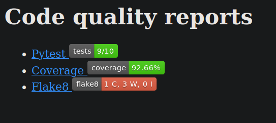

# local-cq
A command-line tool to generate a static webpage with pytest/coverage/flake8 reports


## Installation
Clone the repository and run
```bash
pip install .
```

## Usage
Navigate to the project's directory, then run `local-cq` specifying the source/tests folders:

```bash
local-cq --source src/ --tests tests/
```

After it, a new folder called `cq-report` is created, you can open `cq-report/index.html` with a web browser. You can following the links to see detailed reports.


